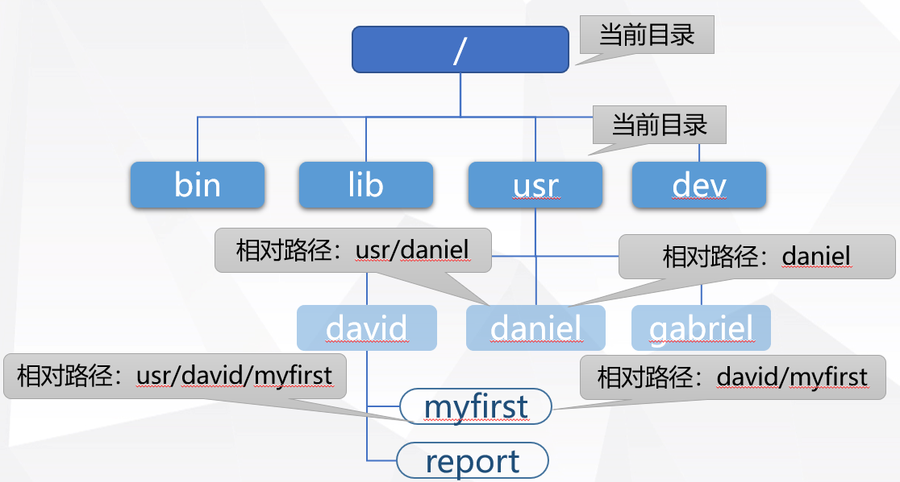
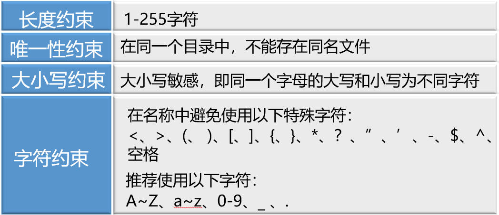
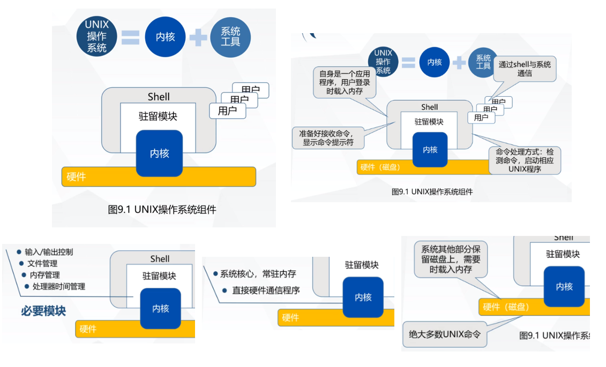
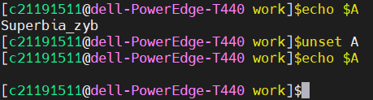
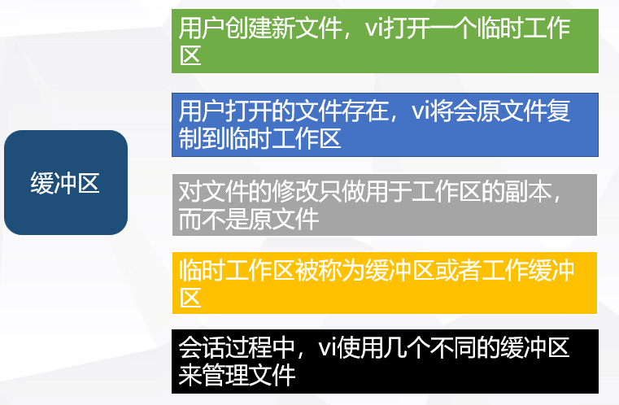

## UNIX 入门

#### 与UNIX建立连接


登录需要**登录名**与**口令**
​	<!--more-->
##### 命令提示符
管理员：#
		普通用户：$
##### passwd命令 修改或创建口令

修改自己的口令

```shell
$passwd
```

修改别人的口令

```shell
$passwd username
```

只有root能创建口令，root创建普通用户后，为其分配初始口令

##### 退出系统

- exit
- logout
- [Ctrl+d]

#### date命令 在屏幕显示当前日期、时间


#### who命令 列出当前登录到系统的所有用户的登录名、终端号、登陆时间


#### who am i命令 显示终端上登陆用户的信息


#### cal命令 显式指定年份的日历表


##### cal month year ：显示指定年月的日历表


#### help命令 提供内部命令帮助信息

```shell
[c21191511@dell-PowerEdge-T440 ~]$help
GNU bash, version 4.4.19(1)-release (x86_64-redhat-linux-gnu)
These shell commands are defined internally.  Type `help' to see this list.
Type `help name' to find out more about the function `name'.
Use `info bash' to find out more about the shell in general.
Use `man -k' or `info' to find out more about commands not in this list.

A star (*) next to a name means that the command is disabled.

 job_spec [&]                            history [-c] [-d offset] [n] or hist>
 (( expression ))                        if COMMANDS; then COMMANDS; [ elif C>
 . filename [arguments]                  jobs [-lnprs] [jobspec ...] or jobs >
 :                                       kill [-s sigspec | -n signum | -sigs>
 [ arg... ]                              let arg [arg ...]
 [[ expression ]]                        local [option] name[=value] ...
 alias [-p] [name[=value] ... ]          logout [n]
 bg [job_spec ...]                       mapfile [-d delim] [-n count] [-O or>
 bind [-lpsvPSVX] [-m keymap] [-f file>  popd [-n] [+N | -N]
 break [n]                               printf [-v var] format [arguments]
 builtin [shell-builtin [arg ...]]       pushd [-n] [+N | -N | dir]
 caller [expr]                           pwd [-LP]
 case WORD in [PATTERN [| PATTERN]...)>  read [-ers] [-a array] [-d delim] [->
 cd [-L|[-P [-e]] [-@]] [dir]            readarray [-n count] [-O origin] [-s>
 command [-pVv] command [arg ...]        readonly [-aAf] [name[=value] ...] o>
 compgen [-abcdefgjksuv] [-o option] [>  return [n]
 complete [-abcdefgjksuv] [-pr] [-DE] >  select NAME [in WORDS ... ;] do COMM>
 compopt [-o|+o option] [-DE] [name ..>  set [-abefhkmnptuvxBCHP] [-o option->
 continue [n]                            shift [n]
 coproc [NAME] command [redirections]    shopt [-pqsu] [-o] [optname ...]
 declare [-aAfFgilnrtux] [-p] [name[=v>  source filename [arguments]
 dirs [-clpv] [+N] [-N]                  suspend [-f]
 disown [-h] [-ar] [jobspec ... | pid >  test [expr]
 echo [-neE] [arg ...]                   time [-p] pipeline
 enable [-a] [-dnps] [-f filename] [na>  times
 eval [arg ...]                          trap [-lp] [[arg] signal_spec ...]
 exec [-cl] [-a name] [command [argume>  true
 exit [n]                                type [-afptP] name [name ...]
 export [-fn] [name[=value] ...] or ex>  typeset [-aAfFgilnrtux] [-p] name[=v>
 false                                   ulimit [-SHabcdefiklmnpqrstuvxPT] [l>
 fc [-e ename] [-lnr] [first] [last] o>  umask [-p] [-S] [mode]
 fg [job_spec]                           unalias [-a] name [name ...]
 for NAME [in WORDS ... ] ; do COMMAND>  unset [-f] [-v] [-n] [name ...]
 for (( exp1; exp2; exp3 )); do COMMAN>  until COMMANDS; do COMMANDS; done
 function name { COMMANDS ; } or name >  variables - Names and meanings of so>
 getopts optstring name [arg]            wait [-n] [id ...]
 hash [-lr] [-p pathname] [-dt] [name >  while COMMANDS; do COMMANDS; done
 help [-dms] [pattern ...]               { COMMANDS ; }

```


#### man命令 提供(内外部)命令帮助信息

```
$mam cat
```


##### man命令中翻页，移行

翻页：后翻一页 空格；前翻一页 b；

移行：后移一行 回车；前移一行 k；

退出：q

#### 更正键盘输入错误

##### 删除单个字符：Backspace 和 [Ctrl+h]

##### 删除一行：[Ctrl+u]

##### 中断程序运行：[Ctrl+c]

## UNIX 文件系统

#### 磁盘组织


#### UNIX 文件类型

##### 普通文件：包含字节序列（程序代码，数据，文本）

##### 目录文件：包含关于其他文件的信息

##### 特殊文件：包含与外部设备相联系的信息，系统中每个设备对应一个文件

#### 目录

目录是文件的一种组织方式


 

##### 主目录：管理员在创建用户时为其分配的特定目录

用户登录时，主动进入主目录，主目录名称通常与用户名相同

用户在其主目录下拥有读、写、执行权限

用户在其主目录下可以创建多个子目录

##### 工作目录：用户现在在文件系统中所在的目录

##### 绝对路径：从根目录 / 开始，到达文件的路径


##### 相对路径：从当前目录开始，到达文件的路径



##### 特殊：

点（.）表示当前目录

点点（..）表示当前目录的父目录

##### 文件，目录，命名规则



#### pwd命令 显示当前工作目录

```shell
$pwd
/home/c21191511/work
```

#### cd命令 改变工作目录

格式：cd [目录]  (绝对路径/相对路径)

##### cd /  跳转到根目录

```shell
$cd /
$pwd
/
```

##### cd 、cd ~ 、cd $HOME 返回主目录

root用户，cd ~ 相当于 cd /root

普通用户，cd ~ 相当于cd /home/当前用户名

```shell
$echo $HOME
/home/c21191511
```

##### 进入别人的主目录(拥有权限)

```shell
$cd ~c09190717
-bash: cd: /home/c09190717: Permission denied
$cd /home/c09190717
-bash: cd: /home/c09190717: Permission denied
```

##### cd - 返回进入此目录之前所在目录

##### cd . 进入当前目录

##### cd .. 进入上一级目录

#### mkdir命令 创建目录

格式：mkdir dir dir2


##### 命令格式 -p  创建多级目录

```shell
$mkdir -p xx/yy/zz
```

#### rm命令 删除文件

格式：rm file

##### 命令选项 -i 删除文件前确认

##### 命令选项 -r 删除指定文件夹及所有子文件，每步都确认


##### 命令选项 -rf 强制删除指定文件夹及所有子文件


#### rmdir命令 删除目录

格式：rmdir  dir(只能为空目录)


#### ls命令 显式指定目录内容

格式：ls dir

##### 命令选项：


 

##### ls -l 长格式详解


###### 第一列：


###### 第二列：文件的链接数

###### 第三列：文件的所有者

通常与文件创建者用户名相同

文件所有者发生转移，则两者不同

###### 第四列：文件所属于的组

管理员创建的用户时，指定用户属于哪个组

用户创建文件时，文件属于用户的组

###### 第五列：文件大小 单位为字节

###### 第六列：文件上一次修改的日期和时间

###### 第七列：文件名称


##### 隐藏文件：文件以.开头

#### 输出重定向

command > filename **覆盖重定向** (不存在则创建)

command >> filename **追加重定向** (不存在则创建)

#### 输入重定向

command < filename **命令行中使用**

command << filename **脚本编程使用**

#### cat命令 显示文件内容

##### 默认：

标准输入读入 输出标准输出

Ctrl + D结束

##### 输入重定向

```shell
$cat <  filename
```

##### 选项：

```shell
$cat -n filename #显示行号
1 Hello world 
2 study hard
```

##### cat创建文件(使用输出重定向)

```shell
$cat > filename 
Hello world
```

##### 文件追加输入

```shell
$cat >> filename
Hello world
```

##### cat复制文件

```shell
$cat filename > filename2
```

#### cp(复制)命令

格式： command source target

##### cp file file2  ,创建文件副本

```shell
$cp profile profile2
$cp /etc/profile profile2

$cp profile profile
file cannot be copied onto itself
```

##### cp file dir  ,将单个文件复制到其他目录

```shell
$cp profile dir
```

##### cp file file2 ... dir  ,将多个文件复制到其他目录

```shell
$cp profile profile2 profile3 dir
```

##### 命令选项 -i (如果目标存在 确认是否覆盖)

```shell
$cp -i Report memos cp: overwrite 'memos/Report' ? (y/n)
```

##### 命令选项 -b (如果目标存在 则先创建该目标的副本，再移动)

```shell
$ls memos Report $cp -b Report memos $ls memos Report Report~ #(内容与原 memos 内的 Report 内容相同)
```

##### 命令选项 -r (复制目录到新目录中)

```shell
$cp -r ./memos ./memos~  #创建目录副本
```

#### mv(移动)命令

格式： command source target

##### mv file dir  ,将文件移到其他目录(非文件所在目录)

```shell
$mv Report memos 
```

##### mv file/dir  file/dir2  ,改变文件名/目录名

```shell
$mv Report Report~$mv dir dir~
```

##### mv file file2 ... dir  ,将文件批量移动到其他目录

```shell
$mv file file2 dir
```

##### 命令选项 -i (如果目标存在 确认是否覆盖)

```shell
$mv -i Report memos mv: overwrite 'memos/Report' ? (y/n)
```

##### 命令选项 -b (如果目标存在 则先创建该目标的副本，再移动)

```shell
$mv -b Report memos$ls memosReport Report~ #(内容与原 memos 内的 Report 内容相同)
```

##### 命令选项 -v 解释操作

```shell
$mv -v Report memos  Report -> memos/Report
```

##### 命令选项 -f (如果目标存在，则覆盖)

```shell
$ mv -f Report memos
```

#### ln(链接)命令

格式： command source target

ln命令 在 **已存在文件** 和 **新文件名** 之间创建链接

##### 应用场景 

在不同目录中频繁操作同一文件

在每个目录中建立该文件的链接文件 通过链接文件对原文件进行操作

链接文件不占用过多磁盘空间


##### ln file file~(指定链接文件名)  ,创建链接文件

```shell
$ln xxx yyy
```

##### ln file file2 ... dir  ,在目录中创建链接文件

```shell
$ln file file2 dir
```


##### 查看文件链接数


硬链接

软链接（符号链接）

#### wc命令

wc命令计算一个或多个文件的行数，字数，字符数

字：没有空格,Tab 分割的字符串

##### wc file  ,统计单个文件

```shell
$wc myfirst 4 30 155 myfirst #行 字 字符
```

##### wc  ,无参数 默认从键盘输入

```shell
$wc Hello world！
```

##### wc file file2 ... ,统计多个文件

```shell
$wc file file21 2 3 file2 3 4 file23 5 7 total
```

##### 命令选项 -l ,统计行数

```shell
$wc -l file
```

##### 命令选项 -c ,统计字符数

```shell
$wc -c file
```

##### 命令选项 -w ,统计字数

```shell
$wc -w file
```

#### 文件名替换

##### ?  ,匹配任意单个字符

```shell
$ls 
 report report2 report22 2report
$ls report? 
 report2 
$ls reprot?? 
 report22 
$ls ?report 
 2report
```

##### *  ,匹配任意个字符，包括空串

```shell
$ls  
 report 23report 2report2
$ls *report 
 report 23report
$ls 2*2 
 2report2
```

##### [list]  ,匹配任意在list中的字符 ; [!list]  ,匹配任意不在list中的字符

```shell
$ls 
 report areport breport aa1 aa2 aa3
$ls [ab]* 
 areport breport aa1 aa2 aa3
$ls [!ab]* 
 report
$ls *[1-3] 
 aa1 aa2 aa3
```

##### 隐藏文件 使用通配符显示隐藏文件，要将.作为指定模式一部分

CentOS 会显示出当前目录内容 与 父目录内容


与其他命令组合使用

```shell
$rm *.*
$rm report?
$cp * ../backup
$mv file[1-4] memos
$rm report*  # 删除格式为reportxxx的文件
$rm report * # 删除report下所有文件
```

#### find 命令

格式： find 路径名 搜索选项 动作选项

在层次目录中根据文件名或文件属性定位文件，并执行操作。

##### 搜索选项 -name ,根据文件名查找文件

```shell
$find . -name "*.c" -print
./1.c
./2.c
```

##### 搜索选项 -size ±n ,根据文件大小查找文件

```cpp
b：代表 512 位元组的区块（默认单位为 b）
c：表示字节数
k：表示KB （1024字节）
w：字 （2字节）
M：兆字节（1024KB）
G：千兆字节 （1024MB）
```

```shell
$find . -size 20c -print
```

##### 搜索选项 -type ,根据文件类型查找文件

```cpp
b：块设备文件。
d：目录。
c：字符设备文件。
l：符号链接文件。
f：普通文件。
```

```shell
$find . -type f -print
```

##### 搜索选项 -atime ±n ,根据最后访问日期(被读取或执行)查找文件

n指据上一次访问所经过的天数(整数) ， +n 表示大于n ，-n 表示小于n

```shell
$find . -atime 1 -print  #24小时之外 48小时之内
$find . -atime -1 -print #24小时之内
$find . -atime +1 -print #48小时之外
```

##### 搜索选项 -mtime ±n ,根据文件最后修改日期(内容被修改)查找文件

n指文件最后被修改后经过的天数(整数) ， +n 表示大于n ，-n 表示小于n

```shell
$find . -mtime 1 -print  #24小时之外 48小时之内
$find . -mtime -1 -print #24小时之内
$find . -mtime +1 -print #48小时之外
```

##### 搜索选项 -newer ,查找比指定文件更新的文件

```shell
$find , -newer first.c -print
```

##### 动作选项 -print ,打印找到的每个文件的路径名

```shell
$find $HEME -name first.c -print
 /usr/david/first.c
 /usr/david/source/first.c
```

##### 动作选项 -exec command {} \;  ,对找到的文件执行command

```shell
$find . -name first.c -mtime +90  -exec rm {} \;
```

##### 动作选项-ok command {} \;  ,在执行command之前要求确认

```shell
$find . -name first.c -mtime +90  -ok rm {} \;
```

#### head 命令

格式：head 文件名

显示文件头部若干行

##### 命令选项 -n ,显示文件前n行

```shell
$head memo (默认显示MEMO前10行)
$head -5 MEMO (显示MEMO前5行)
$head -5 file[1-3](显示多个文件)
```

#### tail 命令

格式：tail 文件名

显示文件尾部若干行

```shell
$tail memo (默认显示MEMOb后10行)
$tail -5 MEMO (显示MEMO后5行)
$tail -5 file[1-3](显示多个文件)
```

#### cut 命令

格式：cut 选项 文件名

从文件中”取出“指定域

##### 命令选项 -f ,指定域位置

默认为Tab(制表符)


##### 命令选项 -c ,指定字符位置


##### 命令选项 -d ,指定域分割字符

空格 与 有意义字符需要用 "" 括起来


#### paste 命令 

格式：paste file file2

逐行连接两个或多个文件

##### 命令选项 -d ,指定具体分隔符,默认为Tab(制表符)

```shell
$paste -d : file file2
 1:2
 3:4
$paste -d " " file file2
 1 2
 3 4
```

#### more 命令

格式：more 文件名

分页查看文件内容

##### 命令选项 -n ,每屏显示n行

##### 命令选项 +n ,从第n行开始显示

##### 命令选项 +/pattern ,在每个文档显示前搜寻该字串(pattern),然后从该字串之后开始显示

##### 命令选项 -c ,在显示每页前清屏

##### 命令选项 -d ,显示提示

在画面下方显示 [Press space to continue, 'q' to quit.] 

如果使用者按错键，则会显示 [Press 'h' for instructions.] 

##### 命令控制键

1. Enter 向下n行，需要定义。默认为1行
2. Ctrl+F 向下滚动一屏
3. 空格键 向下滚动一屏
4. Ctrl+B 返回上一屏
5. q Q 退出more命令

#### less 命令

格式：less 文件名

分页查看文件内容，允许在文件中向后 向前移动

#### UNXI 文件系统原理

UNIX系统将每个文件名与一个整数(i 节点号)相关联,并用文件的i节点号 标识每个文件

表面： 用户通过文件名，打开文件

实际：系统找到文件名对应的i节点号， 通过i节点号找到文件的i节点项，再根据i节点项信息找到文件数据所在块(block)，读出数据

##### ls -i ,查看文件i节点号


复制，不改变文件i节点号


重命名，不改变文件i节点号


移动，不改变文件i节点号


链接，不改变文件i节点号


## Shell

#### Shell 概述


#### Shell种类：

Shell有很多种，在/bin目录中


#### 更改用户Shell

方法：当前Shell中键入新的Shell名字

原理：创建当前Shell子进程，在子进程中运行新的Shell


永久改变Shell：修改账户配置文件，chsh命令

#### 功能详解：



#### 用户与Shell交互


#### 登录过程

用户成功登录系统：Shell 启动

用户退出：Shell 进程结束

##### 启动：


##### 登录：


#### echo命令

将消息参数显示在终端上，没有参数则输出空行. 

echo参数可以无限长

```shell
$echo hello
 hello
```

##### 命令选项 -n  ,输出不换行


##### 命令选项 -e  ,解释反斜杠引导的转义字符，转义符号用""扩起


#### 消除元字符特殊含义

##### \ 将其后一个元字符解释为一个普通字符


##### "" 取消 除 $,',\ 外的元字符特殊含义 ,双引号中保留空格,Tab等


##### ’ ‘ 单引号中任何字符都失去特殊含义 ,单引号中保留空格,Tab等


#### Shell 变量

Shell 为响应客户请求，保存一些信息到Shell变量中

变量有名称，可以通过赋值来控制或定制系统环境


#### set命令 

查看当前使用的Shell变量


#### unset命令

删除不需要的变量



#### 变量赋值

变量名=变量值(字符串) **等号左右不能有空格**

变量前加'$' 使用echo命令显示变量值

```shell
$name="Hello world"
$age=10
$echo $age
 10
```

**做不到将转义字符赋值给变量 再使用echo输出**


#### Shell标准变量


#### HOME 变量

保存用户主目录； 用于其他命令定位主目录


#### PATH 变量

设置Shell 定位命令(程序) 时所要查找的目录名

路径串中以 : 分隔


#### PS1 变量

设置作为Shell顶层命令提示符的字符串

PS1="提示符"

可以对不同段设置不同颜色


```shell
[\[\e[1;32m\]\u\[\e[0m\]@\[\e[1;35m\]\h\[\e[0m\] \[\e[1;33m\]\W\[\e[0m\]]\$
```

##### PS1可使用的转义序列

 


#### PS2 变量

命令提示符2

用户尚未输入完命令前 按下[Return] 后显示的命令提示符 ，默认为 >

#### SHELL 变量

设置登录shell的完整路径

#### TERM 变量

设置终端类型


#### 执行命令 重音符号 `


#### 命令序列：使用分号

shell 从左往右执行


#### 命令编组：使用括号

编组命令可以被重定向


#### 后台处理：使用&符号


command & command2 &...

（显示分配的进程号 ：1328）


#### 链接命令 |

将一个进程的标准输出作为另一个进程的标准输入

command A | command B


#### 延时命令 sleep

sleep n

#### ps命令 获得系统中活动进程的状态

PID：进程ID 

TTY：控制进程的终端号

TIME：进程已运行的时间(S)

CMD：命令名


##### 命令选项 -e 显示所有进程

##### 命令选项 -f 显示完整格式的信息


##### ps aux 显示所有进程，并显示完整格式


#### kill命令 终止进程

发信号给指定进程，进行进程间通信

```shell
$kill -l
 1) SIGHUP       2) SIGINT       3) SIGQUIT      4) SIGILL       5) SIGTRAP
 6) SIGABRT      7) SIGBUS       8) SIGFPE       9) SIGKILL     10) SIGUSR1
11) SIGSEGV     12) SIGUSR2     13) SIGPIPE     14) SIGALRM     15) SIGTERM
16) SIGSTKFLT   17) SIGCHLD     18) SIGCONT     19) SIGSTOP     20) SIGTSTP
21) SIGTTIN     22) SIGTTOU     23) SIGURG      24) SIGXCPU     25) SIGXFSZ
26) SIGVTALRM   27) SIGPROF     28) SIGWINCH    29) SIGIO       30) SIGPWR
31) SIGSYS      34) SIGRTMIN    35) SIGRTMIN+1  36) SIGRTMIN+2  37) SIGRTMIN+3
38) SIGRTMIN+4  39) SIGRTMIN+5  40) SIGRTMIN+6  41) SIGRTMIN+7  42) SIGRTMIN+8
43) SIGRTMIN+9  44) SIGRTMIN+10 45) SIGRTMIN+11 46) SIGRTMIN+12 47) SIGRTMIN+13
48) SIGRTMIN+14 49) SIGRTMIN+15 50) SIGRTMAX-14 51) SIGRTMAX-13 52) SIGRTMAX-12
53) SIGRTMAX-11 54) SIGRTMAX-10 55) SIGRTMAX-9  56) SIGRTMAX-8  57) SIGRTMAX-7
58) SIGRTMAX-6  59) SIGRTMAX-5  60) SIGRTMAX-4  61) SIGRTMAX-3  62) SIGRTMAX-2
63) SIGRTMAX-1  64) SIGRTMAX
```

kill [-signal] PID , 信号名/号码  进程号

```shell
$kill [-15] 5025 默认信号，正常方式终止进程
$kill -9 5025 强制终止进程
$kill -9 0 #PID为0 终止所有与Shell有关的进程
```

用户只能终止自己的进程，管理员可以终止任何进程

#### nohub命令 ：保持执行

用户退出系统时，后台进程不被终止

nohup command &

```shell
nohup bash -c 'sleep 120; echo "job done" '&
```

#### tee命令 分离输出

与 | 一起使用

⬇ 输出到屏幕，输出到file


##### 命令选项 -a 追加输出


##### 命令选项 -i 忽略中断信号，不对中断信号做出响应


#### grep命令 文件搜索

在一个文件 或 一系列文件中查找特定格式(正则表达式 ,RE)

格式：grep pattern file


##### 命令选项 -c 只显示每个文件中包含匹配样式的行数

##### 命令选项 -i 搜索匹配时忽略大小写

##### 命令选项 -l 只显示具有匹配的行的文件名，而不显示匹配行

##### 命令选项 -n 每个输出前显示行号

##### 命令选项 -v 仅显示不匹配的行

##### 命令选项 -w 需要完全匹配


#### sed命令 替换 

#### sort命令 文本排序

对文件内容按照字母或数字顺序排序

格式：sort file

##### 命令选项 -b 忽略前导空格

##### 命令选项 -d 字典顺序排序，忽略标点符号 控制字符

##### 命令选项 -f 忽略大小写区别

##### 命令选项 -n 数字以数值排序，包括负数和小数

##### 命令选项 -o 将输出存储到指定文件中

##### 命令选项 -r 倒序排序，由升序变为降序

##### 命令选项 -k 按照指定字段排序

前提：文件按相应格式建立，默认为空格或制表符

##### 命令选项 -t 指定一个用来区分键位值得字符来比较


#### df命令 列出文件系统磁盘空间使用情况

##### df -h 以易读方式显示


#### du命令 显示目录和文件占用磁盘块情况

格式：du 选项 目录

显示目录，及子目录（无文件）存储空间使用情况（单位：块）


##### 命令选项 -a  ,显示目录中 目录和文件占用情况


##### 命令选项 -b  ,以字节为单位，显示当前目录子目录存储空间使用情况


##### 命令选项 -s  ,显示指定目录  不显示子目录


#### at命令 在指定时间执行一个 或一组命令


##### 命令选项 -l  ,列出所有at命令提交的作业

##### 命令选项 -m  ,作业完成时向用户发送一条确认信息

##### 命令选项 -r  ,从at调度作业中删除指定的作业号


#### type命令 判断一个命令是外部程序/命令，还是内部命令


##### 命令选项 -a 查看所有可能情况


#### time命令 计时程序

格式：time command


- real时间：从命令行开始执行到运行完毕的时间间隔
- user时间：命令运行在用户态的cpu时间
- sys时间：命令运行在核心态的cpu时间

#### tar命令 将一组文件复制到一个文件中

##### 打包文件：tar -cvf tarname file dir

-cvf：创建存档文件+显示打包文件信息+指定生成存档文件名


##### 显示打包文件：tar -tvf tarname

-tvf：列出存档文件内容+显示包中文件详细信息+指定存档文件名


##### 解包包中所有文件：tar -xvf tarname

-xvf：还原被打包文件+显示打包文件信息+指定存档文件名


##### 解包包中指定文件：tar -xvf tarname file


#### UNIX 系统安全

- 确保未授权用户不能得到系统访问权限
- 确保授权用户不能修改系统或其他用户文件
- 授予某些用户一定特权

##### 口令保护


##### 文件保护


##### 目录访问权限


##### 超级用户


#### Shell 环境配置文件

##### 系统配置文件：全局性，适用所有用户

- /etc/profile  设置系统整体环境与自启动程序；登录时执行
- /etc/bashrc  设置系统整体函数与缩写；打开bash时执行

##### 用户配置文件：局部性，适用于某个用户

- ~/.bash_profile  设置登陆用户的bash环境；执行~/.bashrc
- ~/.bashrc            设置当前用户的bash环境；执行/etc/bashrc
- ~/.bash_logout   用户退出bash时执行

#### 登录Shell 与 非登录Shell


#### 配置文件功能

##### /etc/profile


##### /etc/bashrc ：配置系统函数与缩写


##### export 使一系列shell变量作用于子Shell


#### alias命令 为命令起别名

格式：alias 别名=命令名


##### 命令选项 -p 查看已有别名


#### unalias命令 删除别名

格式：unalias 别名


#### UNIX进程：一个正在执行的程序

##### 进程表：为了掌握进程信息，系统为每个进程创建维护进程表


##### 管理进程


## Shell 编程

## Vi编辑器

#### vi工作模式


##### 状态栏

屏幕最底部一行，反馈用户操作结果，错误/其他信息在状态栏显示


#### 工作模式切换


#### 文本输入模式：

- 按 **i** ，进入文本输入模式
- 按 **BackSpace** 或 **[Ctrl + h]** 删除字符
- 按 **Enter** 进入下一行

#### 命令模式：

按 **ESC** 进入命令模式

##### 命令模式➡文本输入模式


##### 命令模式下光标移动

上下左右：

- **h**、**j**、**k**、**l** ; 
- ⬆、⬇、⬅、➡


###### dw ：删除一个单词

###### 数字+名令：2 h; 3 dd; 2 dw ...

##### 搜索字符串

- linux：从光标所在位置**向后**查找字符串

- ?linux：从光标所在位置**向前**查找字符串

	

- n：下一个匹配，与命令搜索方向相同
- N：下一个匹配，命令搜索方向相反

##### 退出Vi

- :wq 保存文件并退出
- :x    保存文件并退出
- ZZ   保存文件并退出
- :q    未修改文件，退出；修改文件未保存，不允许推出 
- :q!   不保存直接退出


#### 缓冲区



#### 编辑多个文件

##### r 文件名：指定文件副本插入当前文件光标下一行

只载入指定文件副本，不改变源文件

##### [a,b] w 文件名：将文件的一部分写到另一个文件

#### 重排文本

##### d：删除指定位置文本，并保存到缓冲区

##### y：复制指定位置文本到缓冲区

##### P：将指定缓冲区的内容放在当前光标位置之上

##### p：将指定缓冲区的内容放在当前光标位置之下

##### c：删除文本并使vi进入文本输入模式

##### dd + P/p：删除当前行，将被删除行放置在光标之上/下

##### yy + P/p：复制当前行，将被复制行放置在光标之上/下

#### 使用操作符与域控制键(0 $ 等)


#### 光标定位键

##### 翻页：

- [Ctrl+d] 向下翻半页
- [Ctrl+u] 向上翻半页

- [Ctrl+f] 向下翻一页

- [Ctrl+b] 向上翻一页

##### 光标移动到首行：1G ，gg，:1

##### 光标移动到第n行： :n

##### 光标移动到文件尾：G

##### n+G ：光标移动到第n行

##### [Ctrl+g] 获取当前行号


#### 未完待续....

