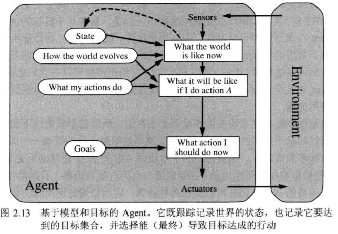

#### $\text{Agent}$与环境

$\text{Agent}$通过**传感器**感知环境，并通过**执行器**对所处环境产生影响。

感知序列：指 $\text{Agent}$ 所收到的**所有输入数据的完整历史**。

$\text{Agent}$在任何时刻的行动依赖于到那个时刻为止，该$\text{Agent}$的**整个感知序列**。 **$\text{Agent}$函数**描述了$\text{Agent}$的行为，它将任何给定感知序列映射为行动，$\text{Agent}$函数通过$\text{Agent}$程序实现。

<!--more-->

#### 什么是理性？

##### 理性

判断$\text{Agent}$理性的标准

- 定义成功标准的性能度量，评价$\text{Agent}$在环境中的行为表现
- $\text{Agent}$对任务环境的先验知识
- $\text{Agent}$可以完成的行动
- $\text{Agent}$截止到此时的感知序列

理性$\text{Agent}$：对每一个可能的感知序列，根据已知的感知序列提供的证据和$\text{Agent}$具有的先验知识，理性$\text{Agent}$应该选择能使其性能度量最大化的行为。

##### 全知者，学习，自主性

理性不等于全知。理性使期望的性能最大化，完美使实际的性能最大化。

$\text{Agent}$应从它所感知的信息中尽可能多的**学习**。

如果$\text{Agent}$依赖于设计人员的先验知识，而不是自身的感知信息我们说该$\text{Agent}$**缺乏自主性**。

#### 任务环境

PEAS描述：Performance（性能度量)，Environment(环境)，Actuators(执行器)，Sensors(传感器)

任务环境的性质：

- 完全可观察的 vs 部分可观察的 （传感器不精确，或缺少部分数据）

- 单$\text{Agent}$ vs 多$\text{Agent}$（竞争性，合作性）

- 确定的 vs 随机的

	如果环境的下一个状态完全取决于当前状态和$\text{Agent}$执行的动作，那么我们说该环境是确定的。否则，它是随机的。

- 片段式的 vs 延续式的

- 静态的 vs 动态的

- 离散的 vs 连续的

- 已知的 vs 未知的 （对于$\text{Agent}$知识状态）

#### $\text{Agent}$的结构

假设该程序要在某个具备物理传感器和执行器的计算装置上运行,我们称为体系结构.
$$
\text{Agent} = \text{体系结构}+\text{程序}
$$

##### $\text{Agent}$程序：$\text{Agent}$函数的实现

输入：传感器得到的当前感知信息

输出：执行器需要的当前执行动作

表驱动：构建对于每个可能感知序列的适当行动的函数表。

#### 简单反射$\text{Agent}$

基于当前感知选择行动，不关注感知历史，需要环境完全可观察。

#### 基于模型的反射$\text{Agent}$

$\text{Agent}$根据感知历史维持内部状态。

增加两种知识：世界是如何独立于$\text{Agent}$而发展的信息；$\text{Agent}$自身的行动如何影响世界的信息。（世界模型）

#### 基于目标的$\text{Agent}$

$\text{Agent}$可以通过**搜索**与**规划**，寻找达到$\text{Agent}$目标的行动序列。

基于目标的$\text{Agent}$会进行推理。

#### 基于效用的$\text{Agent}$

$\text{Agent}$的**效用函数**是性能度量的内在化。

基于效用的$\text{Agent}$选择使其**期望效用**最大化的行动。

#### 学习$\text{Agent}$

四大组件：学习元件，性能元件，评判元件，问题产生器。

- 学习元件：通过评判元件，改进提高。
- 性能元件：负责选择外部行动，接受感知信息并决策($\text{Agent}$本身)。
- 评判元件：评价并反馈$\text{Agent}$行为的好与坏。
- 问题产生器：负责可以得到新的和有信息的经验的行动提议。

