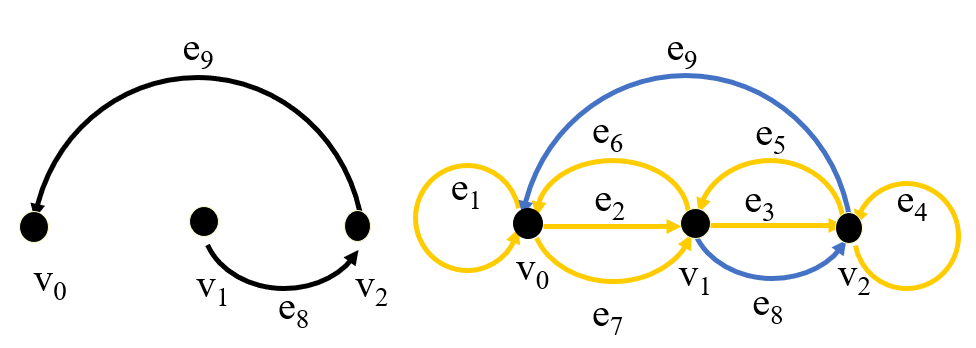
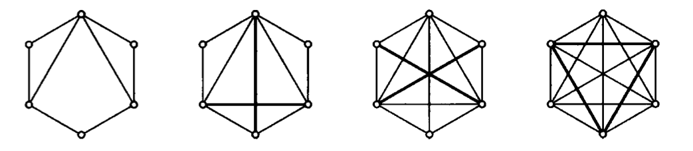
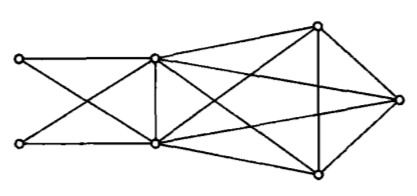

离散笔记 期末自用~~
		<!--more-->
#### 图

#### 树

#### 欧拉路 欧拉图

##### 定义：

设 $G$ 是有向图,$G$ 中一条 $Euler$ 路,就是一条有向路$(e_1, … , e_n)$,其中 $fin(e_n)=init(e_1)$ ,而且 $G$ 中每条弧在此有向路中恰出现一次。 
如果有向图 $G$ 中存在着 $Euler$ 路,就称为 $Euler$ 图。 

设 $G$ 是有向图:
1. 称 $G$ 中点 $v$ 是孤立的,如果 $v$ 的输入和输出次数全为 $0$
2. 称 $G$ 是平衡的,如果 $G$ 中每点 $v$,都有有限的输入次数和输出次数,而且输入次数和输出次数相等。 

##### 性质：

1. 有限平衡有向图,弧数必有限
2. 有向图若存在欧拉路,则必平衡
3. 欧拉图如果没有孤立点,则必强连通
4. 欧拉图中每个点的度一定为偶数

##### 判定欧拉图的充要条件
设 $G$ 是无孤立点的有限有向图。于是,$G$ 有 $Euler$ 路当且仅当 $G$ 是平衡的,并且强连通

##### 欧拉路转化为有向树

设 $G$ 是无孤立点的有限有向图,并且 $G$ 有一条 $Euler$ 路 $(e_1 , … , e_m)$
1. 令 $r=fin(e_m)=init(e_1)$
2. 对每个点 $v \neq r$,令 $e[v]=e_i$ ,其中 $i=max \{ j \ |\ init(e_j)=v \}$

于是,$G$ 的全部点和全部弧 $ \{ e[v] \ | \ v\neq r \}$ 作成的有向图 $G’$ ,是一个以 $r$ 为根的有向树。 

##### 有向树转化为欧拉路

设 $G$ 是有限平衡有向图,$G’$ 是 $G$ 的有向支撑树
设 $G’$ 的根为 $r$ ,$G’$ 中点 $v(\neq r)$ 发出的弧为 $e[v]$
设 $e_1$ 是 $r$ 在 $G$ 中发出的任一条弧,对从 $e_1$开始的任一条有向路: $L=(e_1, e_2, … , e_m)$
若满足：
1. $e_j \neq e_k$ ,当 $j\neq k$ 时。
2.  $e_j = e[v]$ 当且仅当 $init(e_j)=v$ 并且 $G$ 中由 $v$ 发出的弧都出现在 $(e_1, … , e_j)$中。
3.  $L$ 终止在 $e_m$ 当且仅当 $G$ 中从 $e_m$ 的终点发出的弧 都已经在 $L$ 中出现。

则有向路 $L$ 是一条 $Euler$路。 

#### 哈密顿路 哈密顿图 

##### 定义：
设 $G=(P, L)$ 是有限图,$(v_1, … , v_n)$ 是 $G$ 中一条路。如果 $G$ 中每点恰在此路中出现一次,则称此路为 $Hamilton$ 路。
如果 $G$ 中每点,除 $v_1$ 外,恰在此路中出现一次,而 $v_1=v_n $,则此路称为 $Hamilton$ 回路。
如果 $G$ 中有一条 $Hamilton$ 回路,则称 $G$ 为 $Hamilton$ 图。 
显然,由 $m$个节点构成的完全图 $K_m$ 是 $Hamilton$ 图。

##### 性质：
1. 若图中有一点的度为 $1$ ,则无 $Hamilton$ 回路
2. 若图中有一点的度为 $0$ ,则既无 $Hamilton$ 路,又无 $Hamilton$ 回路。
3. 设图中有一点的度为 $2$ ,若有 $Hamilton$ 回路,则以此点为端点的两条边均出现在此回路中。
4. 设图中有一点的度大于 $2$,若有 $Hamilton$ 回路,则只用其中的两条边。 
5. $Hamilton$ 路是 $G$ 的支撑子树,恰有 $n-1$ 条边。
6. $Hamilton$ 回路是 $G$ 的支撑子图,恰有 $n$ 条边。

##### 闭合图
设 $G$ 是有限图。反复连接 $G$ 中不相邻的并且其度之和不小于 $\gamma$ 的点对，直到没有这样的点对为止。
最后所得的图称为 $G$ 的闭合图，记为 $C(G)$ 。
有向图 $G$ 的闭合图 $C(G)$是唯一确定的
2. 若在图 $G$ 中删去 $n$ 个点及与之相连的边，所得图的分支数大于 $n$ ，则 $G$ 不是 $Hamilton$ 图

##### 判定哈密顿图的必要条件
1. 如果图 $G=(P, L)$ 是 $Hamilton$ 图，则对 $P(G)$ 的任一非空子集 $S$ , 都有 $W(G－S) \leq |S|$
	其中：
	$|S|$ 表示集合 $S$ 的元素数，
	$G－S$ 表示在 $G$ 中删除S中的点以及以 $S$ 中的点为端点的所有边而剩下的图，
	$W(G－S)$ 表示图 $G－S$ 的连通分支数。 

##### 判定哈密顿图的充分条件
1. 若 $G=(P, L)$ 是有限图，$\gamma \geq 3 ,\delta \geq \frac{\gamma}{2}$ ，则 $G$ 是 $Hamilton$ 图。
	其中：
	$\gamma $ 表示图 $G$ 中点数，即 $\gamma =|P(G)|$ ，
	$\delta $ 表示图 $G$ 中点的最小度。
2.  设 $G$ 是有限图, 若 $C(G)$ 是完全图，则 $G$ 是 $Hamilton$ 图。
3. 若一个图 $G$ 的任意两点度数之和 $≥ n-1$，$n=|P(G)|≥3$，则该图有 $Hamilton$ 路。
	**证明**：
	向图 $G$ 中增加一个点 $v$ ，并且连接 $v$ 点与 $G$ 中已有的 $n$ 个点，设得到的图为 $G’$ , 这样：$G’$ 中点 $v$ 的度为 $n$ $G$ 中的 $n$ 个点在 $G’$ 中的度分别增加了 $1$
	从而有：
	$G’$ 中来自 $G$ 的任意两个点的度数之和 $≥ n-1+1+1=n+1$
	而 $G’$ 中 $v$ 点与其他任意点的度数之和 $≥ n+1$
	这样，$G’$ 中任意两点度数之和 $≥ n+1=|P(G’)|$
	则 $G’$ 的闭合图是完全图，所以得出 $G’$ 是 $Hamilton$ 图，则 $G’$ 中有 $Hamilton$ 回路
4. 设有限图 $G$ 的度序列$($即 $G$ 的各点的度,按非降序排成的序列$)$为$(d_1,d_2,…,d_{\gamma})$,其中$d_1\leq d_2\leq … \leq d_{\gamma},\gamma \geq 3 $.
如果不存在这样的 $m, m\leq \gamma/2$ ，并使得 $d_m \leq m ,   d_{\gamma -m}\leq \gamma -m $ , 则 $G$ 是 $Hamilton$ 图。

##### 判定哈密顿图的充要条件
1. 设 $G$ 是有限图，$u$, $v$ 是 $G$ 中不相邻的两点，
	并且满足： $d(u)+d(v) \geq \gamma$ 
	则 $G$ 是 $Hamilton$ 图的充要条件是 $G \cup \{ u v \} $ 是 $Hamilton$ 图。
2. 有限图 $G$ 是 $Hamilton$ 图的充要条件是闭合图 $C(G)$ 是 $Hamilton$ 图。 

##### 补图
设 $G$，$H$ 是两个有限图，如果 $P(G)=P(H)$ ，并且对 $G$ ，$H$ 中任意两点 $u、v$ ，$u$ 和 $v$ 在 $G$ 中相邻当且仅当它们在 $H$ 中不相邻，则称 $G$ 是 $H $ 的补图，$H$ 是 $G$ 的补图，可以将 $G$ 记为 $H^c$，也可将 $H$ 记为 $G^c$。 

##### 连接图
设 $G$ ，$H$ 是两个无公共点的有限图。将 $G$ 的每个点和 $H$ 的每个点都用边连接起来得到的图，称为 $G$ 与 $H$ 的连接图

用 $K_m$ 表示由 $m$ 个点组成的完全图。
将如下三个图 ，从左到右顺序连接起来构成的连接图记为 $C_{m,n}$   ($1 \leq m < \frac{n}{2}$ )

$$
K_m^c \longleftrightarrow K_m \longleftrightarrow K_{n-2m}
$$

这是 $K_2^c \longleftrightarrow K_2 \longleftrightarrow K_3$ 的具体图 
若 $1 \leq m < \frac{n}{2}$  ，则图 $C_{m,n}$ 是非 $Hamilton$ 图