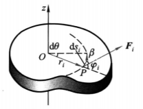
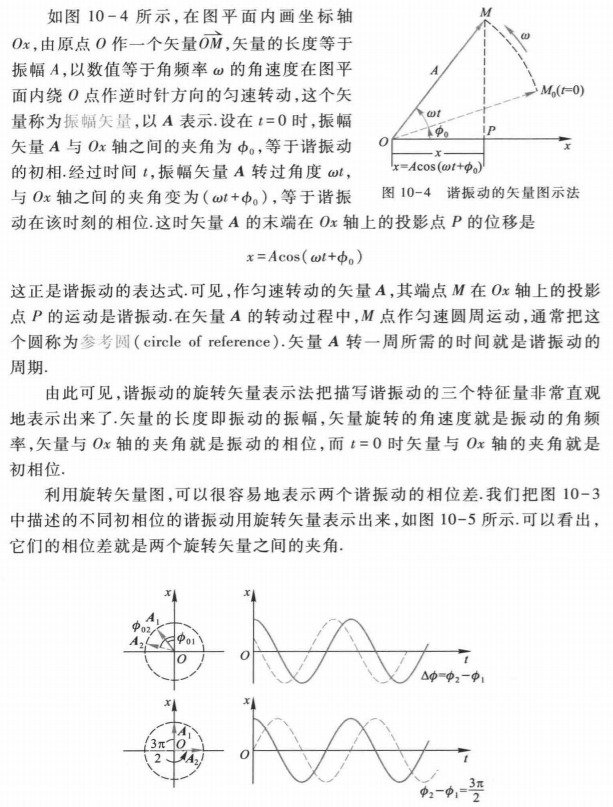

### 力学

#### 质点运动的描述

##### 质心：

 

<!--more-->

##### 参考系与坐标系

##### 位矢：$r=x\cdot i+y\cdot j+z\cdot k\ \ ,\ |r|=\sqrt{x^2+y^2+z^2}$

##### 方向余弦：$cos \alpha=\frac{x}{r}\ ,\ cos\beta= \frac{y}{r}\ ,\ cos\gamma=\frac{z}{r}\ ,\ cos^2\alpha+cos^2\beta+cos^2\gamma=1 $
##### 运动学方程： $r=r(t)=x(t)\cdot i+y(t)\cdot j+z(t)\cdot k\ ,\ \begin{cases} x=x(t)\\y=y(t)\\z=z(t)\end{cases}$ 
##### 位移：有：$r_B=r_A+\overrightarrow{AB} \ ,\ \overrightarrow{AB}=\Delta r$ 
 
##### 速度：
1. 速度：$v=\frac{dr}{dt}=\frac{d}{dt}(xi+yj+zk)=\frac{dx}{dt}i+\frac{dy}{dt}j+\frac{dz}{dt}k\ ,\ |v|=\sqrt{v_x^2+v_y^2+v_z^2}$
2. 平均速度：$\overline{v}=\frac{\Delta r}{\Delta t}$
3. 瞬时速度：$v=\lim \limits_{\Delta t\rightarrow 0} \frac{\Delta r}{\Delta t}=\frac{dr}{dt}\ ,\ |v|=|\frac{dr}{dt}|=\lim\limits_{\Delta{t} \to0  }\frac{\Delta{s} }{\Delta{t}}=\frac{ds}{dt} $

##### 加速度：有：$\Delta{v}=v_B-v_A\ $
 

1. 加速度：$a=\frac{dv}{dt}=\frac{d^2x}{dt^2}i+\frac{d^2y}{dt^2}j+\frac{d^2z}{dt^2}k\ ,\ |a|=\sqrt{a^2_x+a_y^2+a_z^2}$
2. 平均加速度：$ \overline{a}=\frac{\Delta{v}}{\Delta{t}}$
3. 瞬时加速度：$ \lim\limits_{\Delta t\to 0}\frac{\Delta v}{\Delta t}=\frac{dv}{dt}=\frac{d^2r}{dt^2}$

#### 圆周运动
 

##### 加速度
1. 加速度：$a=\frac{d}{dt}(ve_t)=\frac{dv}{dt}e_t+v\frac{de_t}{dt}=\frac{dv}{dt}e_t+\frac{v^2}{R}e_n$
2. 切向加速度：$a_t=\frac{dv}{dt}e_t$
3. 法向加速度: $a_n=\frac{v^2}R{e_n}$

$|a|=\sqrt{a_t^2+a_n^2}=\sqrt{(\frac{dv}{dt})^2+(\frac{v^2}{R})^2 }\ ,\ \varphi=\arctan\frac{a_t}{a_n}$

 

##### 角位置：$\theta$

##### 角位移：$\Delta\theta$

##### 角速度
1. 平均角速度：$\overline{\omega}=\frac{\Delta\theta}{\Delta t}$
2. 瞬时角速度：$ \omega =\lim\limits_{\Delta t\to 0}\frac{\Delta \theta}{\Delta t}=\frac{d\theta}{dt}$

##### 角加速度
1. 平均角加速度：$\overline{\beta}=\frac{\Delta \omega}{\Delta t}$
2. 瞬时角加速度：$\beta=\lim\limits_{\Delta t\to 0}\frac{\Delta \omega}{\Delta t}=\frac{dw}{dt}=\frac{d^2\theta}{dt^2}$

##### 角量与线量的关系：$\begin{cases} v=R\omega \\ a_t=R\beta \\ a_n=\frac{v^2}{R}=v\omega=R\omega^2 \end{cases}$ 

 

##### 曲线运动的加速度：$\begin{cases}a_n=\frac{v^2}{\rho} \\ a_t=\frac{dv}{dt}e_t \\ a=a_n+a_t \end{cases}$

 

#### 质点运动的基本定律
##### 牛顿运动定律
1. 牛顿第一定律
2. 牛顿第二定律
3. 牛顿第三定律

##### 动量
##### 动量定理
##### 动量守恒定律
##### 功,功率
##### 动能定理
##### 势能 
##### 机械能守恒定律
##### 能量守恒定律

##### 角动量：$L=pr=mvr$
##### 角动量定理：$M=r\times F=\frac{dL}{dt}$

#### 刚体的定轴转动基本定律

 

##### 力矩： $\begin{cases} M_0=r\times F \\ M_z=F_2r\sin\varphi=F_2d \end{cases}$
##### 角速度矢量：$ v=\omega\times r$
##### 转动惯量：$J=\sum\limits_{i}\Delta m_ir_i^2=\int r^2dm \ ,\ dm=\begin{cases} \rho dV\\ \sigma dS \\ \lambda dl \end{cases}$
##### 转动定律：$M=J\beta=J\frac{d\omega}{dt} $
 

##### 动量矩定理：
有：$Mdt=Jd\omega \to \int^{t_2} _ {t_1} Mdt=J\omega_2-J\omega_1=L_2-L_1$

动量矩(角动量)：$L=J\omega$

##### 动量矩守恒定理：合外力矩为 $0$ 时, 物体动量矩保持不变

##### 刚体定轴转动的动能定理
1. 力矩的功：$A=\sum\limits_{i}A_i=\int ^{\theta} _ {\theta_0} (\sum_\limits{i}M_i) d\theta $  
2. 转动动能：$E_k=\sum\frac{1}{2} \Delta m_iv_i^2 =\frac{1}{2}J\omega^2$
3. 刚体定轴转动的动能定理：$A = \int_{\theta_1}^{\theta_2}M d\theta=\frac{1}{2}J\omega_2^2-\frac{1}{2} Jw_1^2 $

##### 刚体定轴转动的机械能守恒定律
刚体的重力势能：$\begin{cases} E_p=\sum \Delta m_i g h_i=g\sum \Delta m_i h_i\ \\ \ h_C=\frac{\sum \Delta m_i h_i}{m} \end{cases} \to E_p=mgh_C $

### 静电场
#### 电荷 库仑定律
库仑定律：$\overrightarrow{F}=\frac{q_1q_2}{4\pi\epsilon_0 r^2}\overrightarrow{e_r}\ ,\  \epsilon_0=\frac{1}{4\pi k}$

叠加定理：$F=\sum F_i$ 
#### 静电场 电场强度

电场强度：$\begin{cases} E=\frac{F}{q_0} \\ \overrightarrow{E}=\frac{q}{4\pi\epsilon_0 r^2}\overrightarrow{e_r}\\ \overrightarrow{E}=\int dE =\frac{1}{4\pi \epsilon_0 }\int\frac{dq}{r^2} \overrightarrow{e_r}\end{cases}$

场强叠加原理：$E=\sum E_i$
##### 电场对电荷的作用力：$F=Eq$
##### 电场线 电场强度通量
电场强度通量：$\begin{cases} \Psi_E=E\cdot S=E\cos\theta S\\  \Psi_E=\iint\limits_S E\cos\theta dS=\iint\limits_S E\cdot dS \end{cases}$

 

#### 静电场的高斯定理：$ \iint  \limits_S E\cdot dS=\frac{\sum\limits_iq_i }{\epsilon_0}$
#### 静电场的环路定理 电势

##### 静电场力做功：$A_{a,b}=\int_{a}^{b} F\cdot dl=\frac{qq_0}{4\pi \epsilon_0}(\frac{1}{r_a}-\frac{1}{r_b})$
##### 静电场的环路定理：$\oint\limits_{L} E \cdot dl=0$
##### 电势能：$W_a=A_{a\ \infty}=q_0\int_{a}^{\infty} E\cdot dl$
##### 电势：$V_a=\frac{W_a}{q_0}=\int_{a}^{\infty}E\cdot dl$
##### 电势叠加原理：$V_p=\sum V_i$
##### 电势差(电压)：$U_{ab}=V_a-V_b=\frac{W_a}{q_0}-\frac{W_b}{q_0}=\int_{b}^{a}E\cdot dl$
##### 电场力做功：$A_{ab}=q_0(V_a-V_b)$
##### 电势的计算：$\begin{cases} V_P=\frac{q}{4\pi \epsilon_0 r} \\ V_p=\int \frac{dq}{4\pi \epsilon_0 r}\end{cases}$

#### 电场强度与电势的关系：$\begin{cases}E=-\frac{dV}{dn}e_n=-\nabla V \\E=E_xi+E_yj+E_zk =-(\frac{\partial V}{\partial x}i+\frac{\partial V}{\partial y}js+\frac{\partial V}{\partial z}k)\end{cases}$
#### 模型
##### 电偶极子
##### 均匀带电直线

$$
E=\frac{\lambda l}{2\pi\epsilon_0 a(4a^2+l^2)^{\frac{1}{2}}}
$$

无限长：
$$
E=\frac{\lambda}{2\pi \epsilon_0 a}
$$
##### 带电圆环
$$
E=\frac{qx}{4\pi \epsilon_0(R^2+x^2)^{\frac{3}{2}}}
$$
##### 带电圆盘
$$
E=\frac{\sigma }{2\epsilon_0}[1-\frac{x}{\sqrt{R^2+x^2}}]
$$
##### 无限大平板
$$
E=\frac{\sigma}{2\epsilon_0}
$$
##### 电荷均匀分布的球面
##### 电荷均匀分布的球体
##### 均匀带电无限长圆柱体
##### 均匀带电无限大平面

#### 静电场中的导体
##### 导体的静电平衡：导体中没有电荷做任何定向运动的状态，导体内任意点满足： $E=0$
 

##### 静电平衡时导体上的电荷分布
1. 电荷分布：导体内部没有净电荷存在电荷只能分布于导体的外表面
2. 电荷面密度与场强的关系：$\begin{cases} \iint\limits_s E \cdot dS =E\Delta S = \frac{\sigma\Delta S}{\epsilon_0}\\ E=\frac{\sigma}{\epsilon_0} e_n \ ,\ \sigma\to电荷面密度 \end{cases}$
 

##### 静电屏蔽
 

#### 电容器的电容
##### 孤立导体的电容： $C=\frac{q}{V}=4\pi \epsilon_0 R$
##### 电容器的电容： $C=\frac{q}{V_A-V_B}$
介质的相对电容率：$\epsilon_r=\frac{C}{C_0}$

平行板电容器：$\begin{cases}E=\frac{\sigma}{\epsilon_0} \\ U_{AB}=V_A-V_B=Ed=\frac{\sigma}{\epsilon_0}d\\ C=\frac{q}{U_{AB}}=\frac{\sigma S}{U_{AB}}=\frac{\epsilon_0S}{d} \end{cases}$

圆柱形电容器：$\begin{cases}E=\frac{\lambda}{2\pi \epsilon_0 r}e_r \\ U_{AB}=\int _ {R_A}^{R_B} E\cdot dr =\frac{\lambda}{2\pi\epsilon_0 }\ln\frac{R_B}{R_A} \\ C=\frac{q}{U_{AB}}=\frac{\lambda l}{U_{AB}}=\frac{2 \epsilon_0 l}{\ln\frac{R_B}{R_A}} \end{cases}$

球形电容器：$\begin{cases}E=\frac{q}{4\pi\epsilon_0 r^2} e_r\\ U_{AB}=\int_{R_A}^{R_B}E\cdot dr=\frac{q}{4\pi\epsilon_0}(\frac{1}{R_A}-\frac{1}{R_B}) \\C=\frac{q}{U_{AB}} =4\pi \epsilon_0 \frac{R_AR_B}{R_B-R_A} \ ,=4\pi\epsilon_0 R_A\ \ (R\to \infty)\end{cases}$ 
##### 电容器的串联和并联
1. 电容器的串联：$\frac{1}{C}=\frac{1}{C_1}+...+\frac{1}{C_n}$
2. 电容器的并联：$C=C_1+C_2+...+C_n$

#### 静电场中的电介质
#### 有电介质时的高斯定理与环路定理 电位移
#### 静电场中的能量
外力总功：$A=\int dA=\int_{0}^{Q}\frac{q}{C}dq=\frac{1}{2}\frac{Q^2}{C}$

静电能：$W_e=\frac{1}{2}\frac{Q^2}{C}=\frac{1}{2}C(V_1-V_2)^2=\frac{1}{2}Q(V_1-V_2)$

电场能量密度：$w_e=\frac{1}{2}D\cdot E=\frac{1}{2}\epsilon E_2$

$W_e=\int_V w_e dV=\int_V\frac{1}{2}D\cdot EdV$

### 稳恒磁场
#### 恒定电流

##### 电流 电流密度
1. 电流：$I=\frac{dq}{dt}\ ,\ I=\int_{S}j \cdot e_n dS=\int_{S}j\cdot dS$
2. 电流密度：$j=\frac{dI}{dS_{\perp}}$
3. 电动势：$\xi=\frac{dA}{dq}=\int_{B}^{A}E_k\cdot dl=\oint_L E_k\cdot dl$
 

#### 磁感应强度
1. 磁感应强度：$B=\frac{F_m}{qv}\ ,\ B=\frac{d\Phi}{dS_\perp}$
2. 磁感应线
3. 磁通量：$\Phi=\int_SB\cdot dS$

#### 毕奥萨伐尔定律：$B=\int_L dB=\frac{\mu_0}{4\pi}\int_L\frac{Idl\times e_r}{r^2}$
##### 运动电荷的磁场：$\begin{cases}I=qnvS \\ B_q=\frac{dB}{dN}=\frac{\mu_0}{4\pi}\frac{qv\times e_r}{r^2}\end{cases}$

#### 恒定磁场的高斯定理与安培环路定理
##### 恒定磁场的高斯定理：$\iint\limits_{S}B\cdot dS=0$
##### 恒定磁场的安培环路定理：$\oint\limits_{L} B\cdot dl =\mu_0\sum I$

#### 模型
##### 载流长直导线的磁场
##### 载流线圈轴线上的磁场
##### 载流磁螺旋管内部的磁场
##### 长直圆柱载流导线内外磁场
##### 载流螺绕环内的磁场

#### 带电粒子在电场和磁场中的运动
##### 洛伦兹力： $F=Bqv\sin\theta$
1. 均匀磁场：$Bqv_0=m\frac{v_0^2}{R}\ ,\ R=\frac{mv_0}{Bq}\ ,\ T=\frac{2\pi R}{v_0}=2\pi\frac{m}{Bq}$

2. 非均匀磁场

##### 霍尔效应
霍尔系数：$R_H=\frac{-1}{nq}$
 

#### 磁场对载流导线的作用
##### 安培定律：$F=\int_{L}dF=\int_{L}Idl\times B$
##### 磁场对载流线圈的作用

磁矩：$m=NIS$

力矩：$\begin{cases} M=F_2l_1cos\theta=BIl_1l_2cos\theta=BIScos\theta=BISsin\varphi \\ M=m\times B \end{cases}$

 

##### 磁场力的功

1. 载流导线在磁场中运动：$\begin{cases} F=BIL \\ \Phi =BL|aa'|\\A=F|aa'|=BIL|aa'|=I\Delta \Phi \end{cases}$
 

2. 载流线圈在磁场中运动：$\begin{cases}d\Phi =d(BScos\varphi) \\ dA=Id\Phi \\ A=\int^{\Phi_2}_ {\Phi_1}Id\Phi=I\Delta\Phi \end{cases} $
 

#### 磁场中的磁介质
#### 有磁介质时的高斯定理与安培环路定理 磁场强度
##### 磁场强度：$H=\frac{B}{\mu_0}-M$
##### 有磁介质时的安培环路定理：$\oint H\cdot dl=\sum I$
##### 有磁介质时的高斯定理
 

### 电磁场

#### 电磁感应定律
##### 电磁感应现象： 穿过闭合导体回路 磁通量发生变化 会产生感应电流
##### 楞次定律：闭合回路中感应电流的方向,总使它所激发的磁场来阻止感应电流磁通量的变化

##### 电磁感应定律：$\oint\limits_{L}E_k\cdot dl=-\frac{d}{dt}\int\limits _ {S}B\cdot dS$
感应电动势：$\varepsilon=-N\frac{d\Phi}{dt}=-\frac{dN\Phi}{dt}$

感应电流：$ I=\frac{\varepsilon}{R} =-\frac{1}{R}\frac{d\Phi}{dt}$

感生电荷量：$q=\int_{t_2}^{t_1}Idt=-\frac{1}{R}\int_{\Phi_1}^{\Phi_2}d\Phi=\frac{1}{R}(\Phi_1-\Phi_2)$ 
#### 动生电动势

##### 磁场中运动的导线内的感应电动势：$\begin{cases} \Phi=Bl(vt-x_0) \\ \frac{d\Phi}{dt}=Blv\\ \varepsilon=-\frac{d\Phi}{dt}=-Blv\end{cases}$ , $\begin{cases} eE_k=ev\times B\\\varepsilon=\int_{a}^b E_k\cdot dl=Blv \end{cases}$

 

##### 磁场中转动的线圈内的感应电动势：$\begin{cases} \Phi=BScos\theta \\ \varepsilon =-N\frac{d\Phi}{dt}=NBSsin\theta\frac{d\theta}{dt}  =NBS \omega \ sin \omega t \end{cases}$

 

#### 感生电动势 感生电场

##### 感生电场：$\oint\limits_{L}E_i\cdot dl=-\int\limits_S \frac{\partial B}{\partial t}dS $ 

#### 自感 互感
##### 自感：
以长直螺线管为例：$\begin{cases} B=\frac{\mu_0NI}{l} \\ \Phi_N=NBS= \frac{\mu_0N^2I}{l}\pi R^2 \\ \varepsilon_L=- \frac{d\Phi_N}{dt}=-\frac{\mu_0\pi R^2N^2}{l}\frac{dI}{dt}=-L\frac{dI}{dt} \\ L= \frac{\Phi_N}{I}\end{cases}$

##### 互感：

 

#### 磁场的能量：
有：$\begin{cases} \varepsilon -L\frac{dI}{dr}=IR \\ \int_{0}^{t}\varepsilon Idt=\int_{0}^{t_0}LIdI+\int_{0}^{t}RI^2dt \\
W_m=\frac{1}{2}LI_0^2 =\frac{1}{2}(\mu nV)(\frac{B}{\mu n})^2=\frac{1}{2}BHV \ (长直螺线管)\\ w_m=\frac{W_m}{V}=\frac{1}{2}BH \\ \to \frac{1}{2} LI_0^2=\frac{1}{2}\int\limits_VBHdV\end{cases}$
#### 位移电流 电磁场理论
##### 位移电流：$I_d=S\frac{dD}{dt}=\frac{d\boldsymbol{\psi}}{dt}$
##### 位移电流密度：$j_d=\frac{dD}{dt}=\frac{1}{S}\frac{d\boldsymbol{\psi}}{dt}$

$\oint_L H\cdot dl =I+I_d=\int\limits_sj\cdot dS+\int\limits_s \frac{\partial D}{\partial r}\cdot dS$

 

##### 麦克斯韦方程组：$\begin{cases} \end{cases}$

### 机械振动

#### 简谐振动

##### 简谐振动方程

弹簧振子：$F=-kx=ma=m\frac{d^2x}{dt^2} \to w^2=\frac{k}{m}$

简谐运动方程：$\begin{cases} \frac{d^2y}{dt^2}=-w^2y \\ x=Acos(\omega t+\varphi_0) \\ v=\frac{dx}{dt}=A\omega cos(\omega t+\varphi_0 +\frac{\pi}{2}) \\a=\frac{d^2x}{dt^2}=A\omega^2cos(\omega  t+\varphi_0+\pi) \end{cases} \to \begin{cases} A=\sqrt{x_0^2+\frac{v_0^2}{\omega^2} }\\ \varphi_0=arctan(-\frac{v_0}{\omega x_0}) \end{cases}$

 

##### 描述简谐振动的特征量
1. 振幅：$A=\sqrt{x_0^2+\frac{v_0^2}{\omega^2}} $
2. 周期：$T=\frac{2\pi}{\omega}=2\pi \sqrt{\frac{m}{k}}$
3. 频率：$f=\frac{1}{T}=\frac{\omega}{2\pi} \sqrt{\frac{k}{m}}$
4. 相位，初项，相位差：$\varphi=\varphi_0+wt\ ,\ \Delta\varphi=\varphi_2-\varphi_1 $

##### 简谐振动的能量：$\begin{cases} E_p= \frac{1}{2} kx^2 =\frac{1}{2} kA^2cos^2(\omega t+\varphi) \\ E_k=\frac{1}{2}mv^2=\frac{1}{2}m\omega^2A^2sin^2(\omega t+\varphi) \\ E=E_k+E_p=\frac{1}{2}kA^2 \end{cases} \to \frac{d^2x}{dt^2}+\frac{k}{m}x=0$

 

##### 简谐振动的旋转矢量表示法

 

#### 简谐振动的合成
##### 一维
1. 同一直线 同频率：$\begin{cases}x=x_1+x_2=A_1cos(\omega t+\varphi_{01})+A_2cos(\omega t+\varphi_{02})=Acos(\omega t+\varphi_0 )\\ A=\sqrt{A_1^2+A_2^2+2A_1A_2cos(\varphi_{02}-\varphi_{01})} \\ tan \varphi_0  =\frac{A_1sin\varphi_{01} +A_2sin\varphi_{02}}{A_1cos\varphi_{01}+A_2cos\varphi_{02}} \end{cases}$

2. 同一直线 不同频率：
 

##### 二维
1. 相互垂直 同频率：$\begin{cases} x=A_1cos(\omega t+\varphi_{01}) \\ y=A_2cos(\omega t+\varphi_{02}) \\ \frac{x^2}{A_1^2} +\frac{y^2}{A_2^2}-2\frac{xy}{A_1A_2}cos(\varphi_{02}-\varphi_{01})=sin^2(\varphi_{02}-\varphi_{01}) \end{cases}$

 

2. 相互垂直 不同频率

 

#### 振动的分解
#### 阻尼振动 受迫振动 共振
#### 电磁振荡
##### LC电路
##### 受迫振荡 电共振

### 机械波
#### 机械波的产生与传播
##### 机械波产生条件
##### 机械波传播特点
1. 横波
2. 竖波
 

##### 波的几何描述
 

##### 描述波动的特征量
1. 波长：$\lambda$
2. 周期 频率：$T\ ,\ f$
3. 波速：$u$

有：$u=\frac{\lambda}{T}=f\lambda$ , 波在不同介质中传播时 波速不同 波长不同 频率不变

#### 平面简谐波的波函数：$y(x,t)=Acos[\omega (t \mp \frac{x}{u})+ \varphi_0 ]$

 

#### 平面波的波动方程：$\frac{\partial^2 y}{\partial x^2}=\frac{1}{u}\frac{\partial^2 y}{\partial t^2}$

#### 波的能量 波的强度
##### 波的能量 能量密度

##### 能流 波的强度
##### 平面波与球面波的振幅

#### 电磁波
#### 惠更斯原理 波的衍射 反射与折射
#### 波的叠加原理 波的干涉 驻波
#### 多普勒效应

### 光的干涉 
### 光的衍射
### 光的偏振